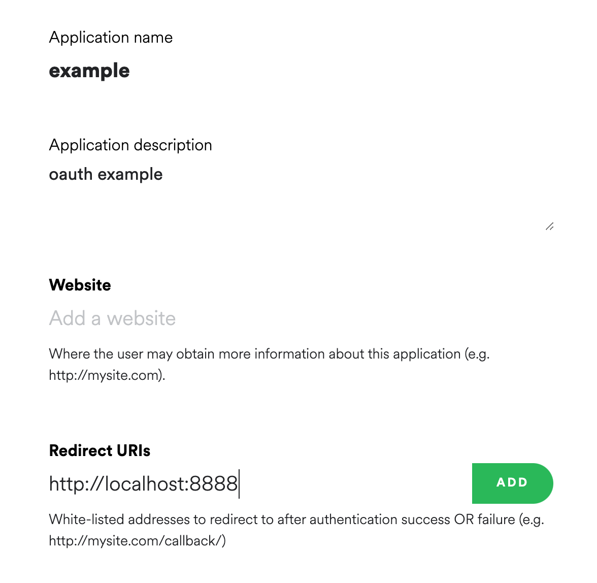
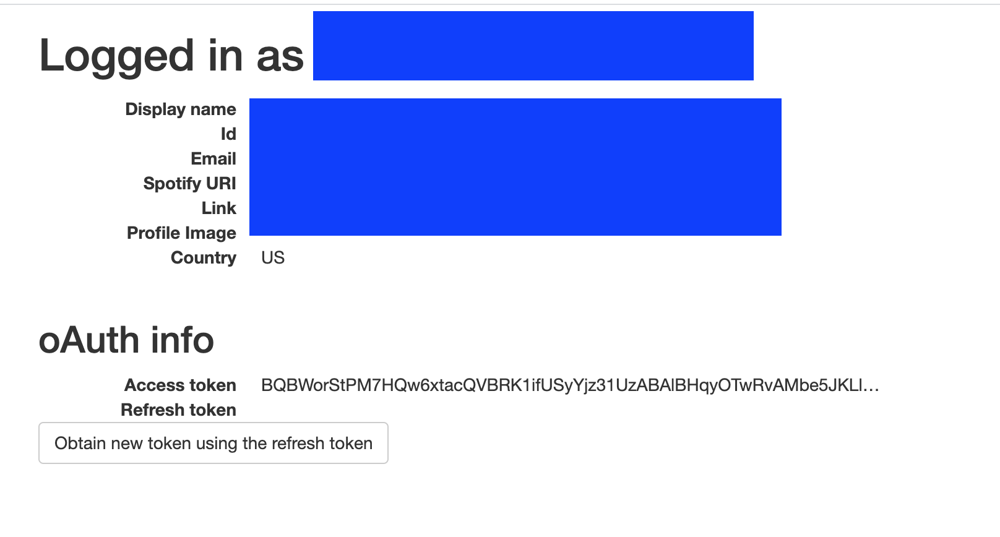
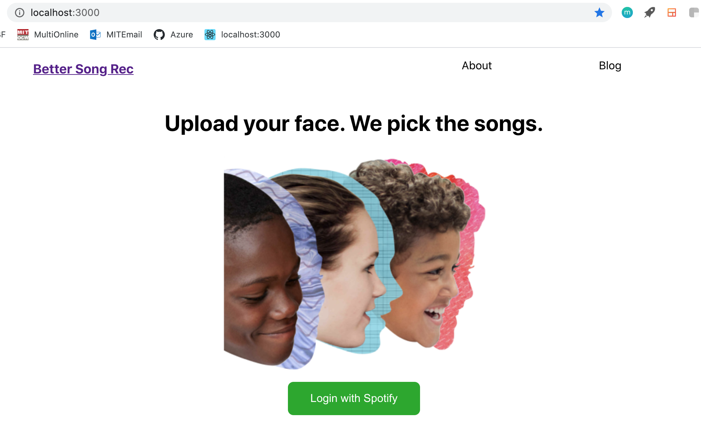
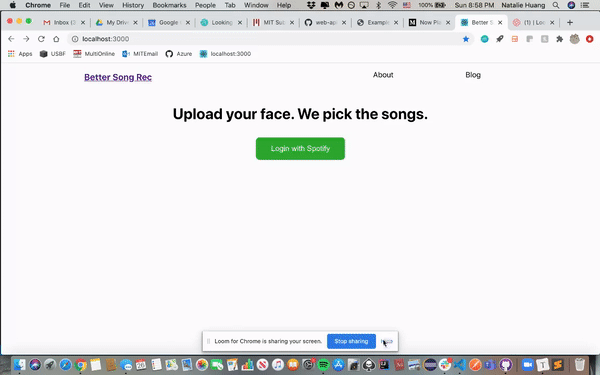

## Part 2: Creating a React App with Spotify Oauth

In my previous post, I outlined how to detect emotion in photos using the Microsoft Face API and Azure Functions. In the second part of this series, we'll be focusing on creating the actual React frontend and getting the user logged in to Spotify before getting any song recommendations.


As a refresher, here's an overall flowchart.


### Setting up Oauth

Disclaimer: this part of my tutorial is completely ripped off from [this](https://medium.com/@jonnykalambay/now-playing-using-spotifys-awesome-api-with-react-7db8173a7b13) higher-quality and very excellent blog post/video by Jonny Kalambay. If you're looking for a better explanation, I suggest you take a look.

#### Here's what I'm assuming:

- you've installed npm
- you understand the basics of Node and maybe Express or React(if not, doesn't matter because I didn't know anything either)
- you have a Spotify account


Let's talk about Oauth: it's an open-standard authorization protocol or framework that describes how unrelated servers and services can safely allow authenticated access to their assets without actually sharing the initial, related, single logon credential. If you've ever gone to a website that's asked you to log in with Google or Facebook, that's using Oauth. 


There are different types of authorization flows, but today we'll be using the [authorization code flow](https://developer.spotify.com/documentation/general/guides/authorization-guide/#authorization-code-flow). Spotify provides a great diagram of this workflow: 


This basically allows the user to login, and then redirects the user to a specified webpage with an access token in the URL, which our app can then use to make API calls. Now that we've got the basic concept down, let's get started!


### Step 1- Registering your App

Login to Spotify's developer dashboard [here](https://developer.spotify.com/dashboard/login). Then press **create an app**. Give it a cool name and press **Create**!

Click into your app to a page like this:


Save and don't reveal your Client ID and Client Secret. Then press on **EDIT SETTINGS**. We're going to add a Redirect URI here- this is the URI that the user will be redirected to once authorization is complete. For now, use `http://localhost:8888/callback`.  **MAKE SURE YOU CLICK THE SAVE BUTTON AT THE BOTTOM.**




### Step 2- Creating the Server

Now, we're going to be writing the actual authorization code. And by writing, I mean copying the example code that Spotify's excellently documented API has provided. Here's [the link](https://github.com/spotify/web-api-auth-examples) to the repo, which can also be found on Spotify's developer site. In your code editor(I'm using Visual Studio Code), run these commands:

```
git clone https://github.com/spotify/web-api-auth-examples.git server
cd server
npm install
```

This will clone the Github repo code into a new folder called server, and install all the necessary dependencies. Note! The repo has three folders, one for each type of authorization flow. The only one we need is the `authorization_code` folder. In my final project, I deleted the other folders and moved everything out into my `server` folder, but don't worry about that for now.


Go into the `authorization_code` folder, and then into app.js

You'll see this code near the top:

``` 
var client_id = ‘CLIENT_ID’; // Your client id
var client_secret = ‘CLIENT_SECRET’; // Your secret
var redirect_uri = ‘REDIRECT_URI’; // Your redirect uri
```

You're going to replace `client_id`, `client_secret`,  and `redirect_uri`  with your own id and secret and `http://localhost:8888/callback`. **This isn't a permanent solution!** To protect your id and secret, we're going to move them into an untracked .env file later. 


Now, we're going to test if the server is set up correctly. In terminal `cd` to the authorization_server directory, and then use `node app.js`  to get the application running.


Now go to `http://localhost:8888`. You should see this page:


Pressing login should take you to an authorization page. Once you login, you'll be redirected to a page like this: 



Check out the url of the final page! 


Notice that it's the original url, just with an access token attached. If you also take a closer look at the code, notice that clicking login will take you to `localhost:8888/callback`, where a Spotify API call is made to get a token. You're then redirected to `localhost:8888/#access_token=...` , where we can actually access the token from the url.


### Setting up the Client in React

#### Step 1- Create the App

If you haven't already, use the command `npm install create-react-app -g` to install create-react-app globally on your machine. Then, get back into your Visual Studio Code root directory and use these commands to make a React app:

```
create-react-app client
cd client
```

You should now have two folders: server and client. **Before** you install the dependencies, go into your  `package.json` file in your client folder. Add this line to your dependencies:

```json
"spotify-web-api-js": "^1.4.0"
```

We're going to be using [this](https://github.com/JMPerez/spotify-web-api-js) library, which can be found on the Spotify developer site, to make most of the Spotify API calls.

Now you can run these commands to install your dependencies and start running your app.

```
npm install
npm start
```


Navigate to `http://localhost:3000`  to see if your app is up and running. It should look something like this:


#### Step 2- Create the Homepage

So this React app will involve some very simple routing- basically this means that different urls will render different pages. For example, going to `localhost:3000/home`  will take you to a homepage, while going to `localhost:3000/song`  will perhaps show a list of songs. We're going to focus on creating a basic homepage, which will look something like this: 




Get started by making a new file called `Home.js`. I stuck this inside a folder `components`, since we're going to end up making a lot more files later on. 


Add in this code:

```react
import React from 'react';

function Home() {
  return (
    <div className="home-page">
        <h1>Upload your face. We pick the songs.</h1>
        <a href="https://localhost:8888">
          <button className="green-btn">Login with Spotify</button>
        </a>   
    </div>
  );
}

export default Home;

```

This is a simple functional component, and simply contains a header and button. Notice that the button is redirecting us to our OAuth server page.


Return to your React app page and check to make sure the button takes you to  the OAuth page, but don't log in quite yet.


#### Step 2- Creating the Redirect Page

After the user logs in, we need to redirect them to a different page in our React app. To do this, I'm creating a new file called `UploadFace.js`.  Note: this name ends up being kind of misleading, since this ends being the page where all the uploading and song-finding happens, but just bear with me. 


Copy paste this code into UploadFace:


This creates a class component with state variables `token` and `userInfo`.  Once the component mounts, we're using the lifecycle method `componentDidMount()` to immediately call the `getHashParams` function. The `getHashParams`  function is actually used in the Spotify Oauth example code to parse the query string and extract the token. We're stealing this function to get the access token in our client-side.


Once we get the token, we set our state variable `token`  and make a API call using the token to get the user's display name and id. To test that this actually works, let's render a "Logged in as {display_name}" statement. This will change later.

```react
import React from 'react';

class UploadFace extends React.Component {
  constructor(){
    super()
    
    this.state = {
      token: "",
      userInfo: []
    }
  }

  //calls getHashParams and uses token to get user info
  componentDidMount(){
    const params = this.getHashParams();
    this.setState({token: params.access_token})
  
    fetch('https://api.spotify.com/v1/me',{
      method: 'GET',
      headers: { 'Authorization' : 'Bearer ' + params.access_token}
    }).then(resp => resp.json()).then(data => this.setState({userInfo: [data.display_name, data.id]}))
    
  }

  //this parses the query string and extracts the token
  getHashParams() {
    console.log('in hash params')
    var hashParams = {};
    var e, r = /([^&;=]+)=?([^&;]*)/g,
        q = window.location.hash.substring(1);
    while ( e = r.exec(q)) {
       hashParams[e[1]] = decodeURIComponent(e[2]);
    }
    return hashParams;
  }

  render(){
    <h3>Logged in as {this.state.userInfo[0]}</h3>
  }
}

export default UploadFace;

```


Don't run this just yet- we have some routing to do.


#### Step 3- Adding Routing

Go back into your App.js file. In your terminal run `npm install react-router-dom` .  We'll be using react-router-dom to route our function, meaning that we'll be able to display different pages depending on the url.


Copy paste this code:


Notice that I'm using  `BrowserRouter`(saved as Router) and `Route`  from the react-router-dom library. I'm surrounding all the components in my return statement with `<Router><Router/>`, which will allow me to specifiy actual Routes. 

```react
import React from 'react';
import './App.css';
import UploadFace from './components/UploadFace'
import Home from './components/Home'
import {BrowserRouter as Router, Route} from 'react-router-dom';

class App extends React.Component {

  render() {
    return (
      <Router>
        <div className="App">
          <Nav />
          <Route path="/face" component={UploadFace}/>
          <Route path="/" exact component={Home}/>
        </div>
      </Router>  
    );
  }
}

export default App;

```


These lines:

```react
<Route path="/face" component={UploadFace}/>
<Route path="/" exact component={Home}/>
```

are doing the actual routing. The path indicates the url that the user needs to go to for the page to render, and the component is the component that should be rendered at that specific url. Notice that there's a `<Nav />` component that isn't surrounded by route- this means that it will alway be rendered regardless of url. This is the navbar at the top of the page- you can customize this however you want, or eliminate it entirely.


We're almost ready to test- the last step is actually to change the redirect url of your server. Find this line in your code(it should be around line 107):

```js
res.redirect('/#' +
          querystring.stringify({
            access_token: access_token,
            refresh_token: refresh_token
          }));
```

This specifies the url that the access_token should be attached to. For us, it's going to be the React `UploadFace.js`  page. Replace `'/#'` with `'http://localhost:3000/face/#'`.  It's important to keep the hashtag because without it, our `getHashParams`  function won't be able to parse the query string. Also notice that we are adding `/face` to our url- this changes the route so that we will see the UploadFace page instead of our homepage.


Make sure both your server and app are running(use `node app.js` for your server and `npm start` for your React app) and test it out!





Yay it works! (hopefully)


